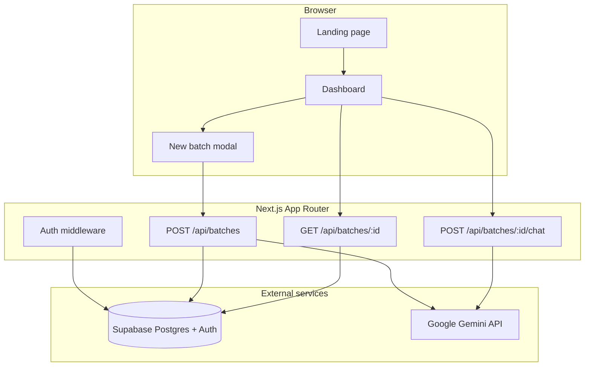

# Pulse

**Turn scattered customer feedback into a clear action list.**

Pulse is an AI-powered feedback triage app for small product teams. Upload a CSV, paste responses, or drop in a spreadsheet — Gemini classifies every item by category, sentiment, and priority, then surfaces trends across batches over time.

Built as a full-stack portfolio project: auth, database, AI pipeline, dashboard UX, and production deployment patterns.

<p align="center">
  <a href="#features">Features</a> ·
  <a href="#tech-stack">Tech stack</a> ·
  <a href="#architecture">Architecture</a> ·
  <a href="#getting-started">Getting started</a> ·
  <a href="#what-this-demonstrates">For recruiters</a>
</p>

<p align="center">
  
  
  
  
  
  
</p>

---

## The problem

Startup teams collect feedback everywhere — support tickets, survey exports, sales notes, NPS comments — but rarely have time to read, tag, and prioritize all of it. Important bugs get buried. Praise gets ignored. Trends only show up when something breaks.

## The solution

Pulse gives ops and product teams a lightweight workflow:

1. **Ingest** feedback via paste, CSV, or Excel upload (with smart column detection)
2. **Classify** each item with AI into category, sentiment, and priority
3. **Review** stat cards, an AI-written batch summary, and filterable tables
4. **Compare** batches over time to spot recurring themes
5. **Ask** follow-up questions in a batch-scoped AI chat

---

## Features

| Area | What it does |
|------|----------------|
| **AI classification** | Tags each item as Bug, Feature request, Pricing, UX issue, Praise, or Other — with sentiment and priority |
| **Batch summaries** | Gemini generates a short narrative summary per upload |
| **Batch chat** | Ask questions about a specific batch ("What are the top UX complaints?") |
| **Smart file parsing** | Auto-detects feedback columns in CSV/XLSX exports from Google Forms, Typeform, etc. |
| **Filtering** | One-click filters for sentiment, priority, and category |
| **Batch history** | Switch between uploads and compare negative %, top themes, and high-priority counts |
| **Auth** | Supabase email magic link — no passwords to manage |
| **Dark mode** | System-aware theme toggle |

---

## Tech stack

| Layer | Choices |
|-------|---------|
| **Framework** | Next.js 16 (App Router), React 19, TypeScript |
| **Styling** | Tailwind CSS 4, shadcn/ui, Base UI |
| **Database** | Supabase Postgres with Row Level Security |
| **Auth** | Supabase Auth (SSR cookie sessions) |
| **AI** | Google Gemini 2.5 Flash via `@google/generative-ai` |
| **Validation** | Zod schemas for AI JSON output |
| **File parsing** | PapaParse (CSV), SheetJS (XLSX) |
| **Deploy** | Vercel-ready (`vercel.json` for long-running batch API) |

---

## Architecture



**AI pipeline highlights:**

- Feedback is chunked into groups of 10 items per Gemini request to manage rate limits
- Structured JSON output validated with Zod before writing to the database
- Batch status tracked as `processing` → `completed` / `failed`
- API key stays server-side only — never exposed to the client

---

## What this demonstrates

Useful for evaluating full-stack and AI integration skills:

- **Product thinking** — solves a real ops workflow, not a toy CRUD app
- **Next.js App Router** — server/client components, API routes, middleware auth
- **Supabase** — schema design, RLS policies, typed client, magic-link auth flow
- **LLM engineering** — prompt design, structured output, chunking, error handling
- **Data ingestion** — heuristic column detection for messy real-world exports
- **UI/UX** — responsive dashboard, loading states, filters, chat panel, dark mode
- **Production awareness** — env config, deploy docs, API timeouts, batch size limits

---

## Getting started

### Prerequisites

- Node.js 20+
- A [Supabase](https://supabase.com) project
- A [Gemini API key](https://aistudio.google.com/apikey)

### 1. Clone and install

```bash
git clone https://github.com/costeffective/pulse.git
cd pulse
npm install
```

### 2. Environment variables

Copy `.env.example` to `.env.local`:

```bash
NEXT_PUBLIC_SUPABASE_URL=https://your-project.supabase.co
NEXT_PUBLIC_SUPABASE_ANON_KEY=your-anon-or-publishable-key
GEMINI_API_KEY=your-gemini-api-key
```

### 3. Database

Run the migration in `supabase/migrations/001_initial_schema.sql` against your Supabase project (SQL editor or CLI).

Tables:

- `batches` — one feedback upload per user
- `feedback_items` — classified rows linked to a batch

### 4. Auth redirect URLs

In Supabase Dashboard → Authentication, add:

- `http://localhost:3000/auth/callback`
- `https://your-production-domain/auth/callback`

### 5. Run locally

```bash
npm run dev
```

Open [http://localhost:3000](http://localhost:3000).

---

## Usage

1. Sign in with your email (magic link)
2. Click **New batch** — paste feedback or upload CSV/XLSX
3. Wait for AI classification (large batches may take 30–60s)
4. Review insights, filter the table, and open **Ask AI** for follow-up questions
5. Switch batches to compare trends over time

**Limits:** max 200 items per batch · Gemini called in chunks of 10

---

## Project structure

```
src/
├── app/
│   ├── api/batches/          # Create & fetch batches
│   ├── api/batches/[id]/chat # Batch-scoped AI chat
│   ├── auth/callback/        # Supabase OAuth callback
│   ├── dashboard/            # Main app UI
│   └── page.tsx              # Marketing landing page
├── components/
│   ├── brand/                # Logo & pulse mark
│   ├── dashboard/            # Table, insights, chat, filters
│   └── ui/                   # shadcn components
└── lib/
    ├── gemini.ts             # Classification & summary prompts
    ├── csv.ts                # CSV/XLSX parsing & column detection
    ├── stats.ts              # Aggregations & filters
    └── supabase/             # Client, server, middleware helpers
supabase/migrations/          # Postgres schema + RLS
docs/                         # Integration roadmap
```

---

## Deploy to Vercel

1. Push to GitHub and import the repo in [Vercel](https://vercel.com)
2. Set `NEXT_PUBLIC_SUPABASE_URL`, `NEXT_PUBLIC_SUPABASE_ANON_KEY`, and `GEMINI_API_KEY`
3. Add your production URL to Supabase auth redirect URLs
4. Deploy

`vercel.json` sets a 60s max duration on `POST /api/batches` for large uploads (Vercel Pro recommended).

---

## Roadmap

See [`docs/INTEGRATIONS.md`](docs/INTEGRATIONS.md) for a planned ingestion layer — Google Forms, Typeform, Tally webhooks, and scheduled sync jobs.

---

## Screenshots

Add images to `docs/screenshots/` and reference them here for your GitHub profile:

```markdown


```

Run the app locally, capture the landing page and dashboard, and drop PNGs in that folder — recruiters scan visuals first.

---

## License

MIT — feel free to use this as a reference for your own projects.
