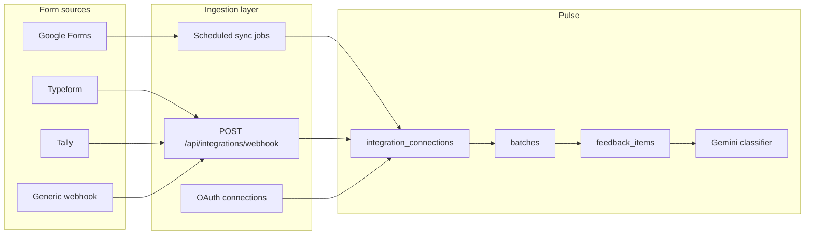

# Form Integrations Plan

Pulse can evolve from manual CSV uploads to live form ingestion.

## Goals

- Pull responses from Google Forms, Typeform, Tally, and similar tools
- Map form fields to feedback text + metadata (name, email, timestamp, ratings)
- Create batches on a schedule or in real time
- Reuse the existing Gemini classification pipeline

## Architecture

## Phase 1 — Foundation

**Database**

- `integration_connections` — user_id, provider, status, encrypted credentials, field_mapping jsonb, last_synced_at
- `integration_events` — raw payload log for debugging

**API**

- `POST /api/integrations/webhook/:connectionId`
- `GET/POST /api/integrations`
- Field mapping UI in dashboard

Reuse `src/lib/csv.ts` column detection for webhook JSON payloads.

## Phase 2 — Google Forms

### Option A: Google Sheets bridge (fastest MVP)

1. Form responses sync to a linked Google Sheet
2. Pulse OAuth (read-only Sheets scope)
3. Cron polls new rows every 15 minutes
4. Uses existing spreadsheet parser
5. Creates incremental batches

### Option B: Google Apps Script relay

1. Apps Script on the response Sheet POSTs new rows to a Pulse webhook
2. Near real-time without polling

**Recommendation:** Start with Sheets polling; offer Apps Script for power users.

## Phase 3 — Typeform, Tally, Jotform

Native webhooks:

1. User creates a connection → receives webhook URL + secret
2. User configures the form tool
3. Each submission is verified, mapped, and classified

| Source field | Pulse |
|--------------|---------------|
| Long text answer | `text` |
| Email | `metadata.Email` |
| Name | `metadata.Name` |
| Submitted at | `metadata.Timestamp` |

## Phase 4 — Product UX

- Integrations page: connect, test, pause, last sync
- Auto-batch naming from source
- Deduplication via external response IDs in metadata
- Alerts for high-priority negative feedback

## Security

- Encrypt OAuth tokens at rest
- Webhook HMAC verification per connection
- RLS on integration tables

## Suggested order

1. Metadata + smart CSV parsing (done)
2. Generic webhook + field mapping
3. Google Sheets polling
4. Typeform / Tally templates
5. Integrations settings UI
